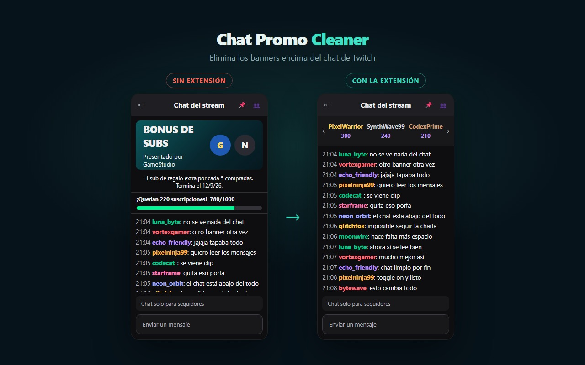
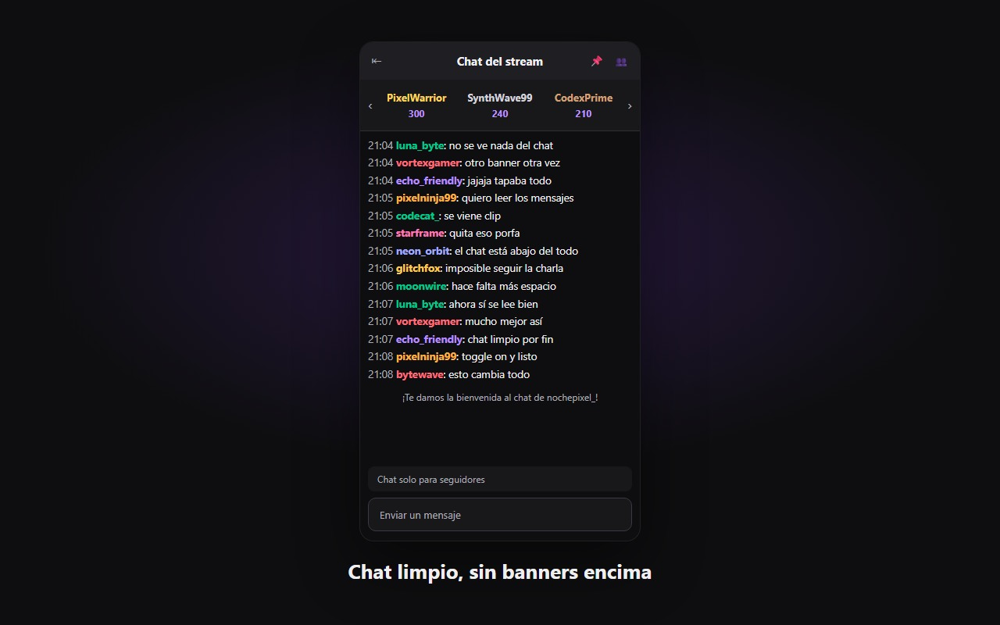
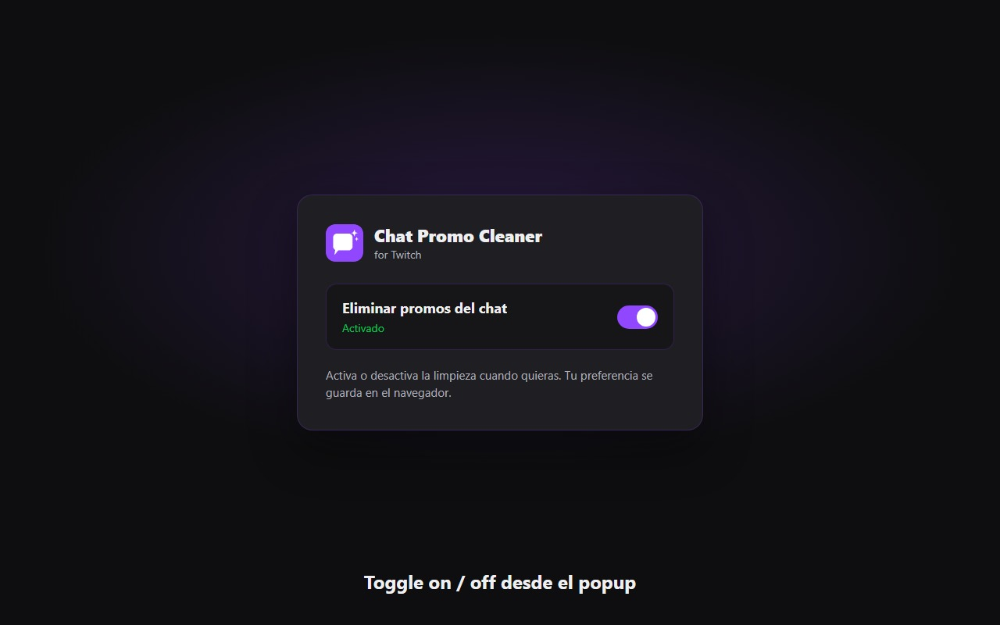

  

<h1 align="center">Chat Promo Cleaner</h1>

  <strong>Chat de Twitch sin banners encima.</strong> 
  Oculta channel skins, bonus de subs y anuncios de colaboración que tapan el chat. Dos toggles.

  
  
  

  🌐 Sitio: <a href="https://chatpromocleaner.onrender.com/">chatpromocleaner.onrender.com</a> 
  🏪 <a href="https://chromewebstore.google.com/detail/twitch-chat-promo-cleaner/lddfcnbejkkpcaojffpppnhbojbepool">Chrome Web Store</a> 
  📦 Este repo es <strong>público</strong> — código open source

---

## Instalación

1. Abre la ficha en [Chrome Web Store](https://chromewebstore.google.com/detail/twitch-chat-promo-cleaner/lddfcnbejkkpcaojffpppnhbojbepool)
2. Pulsa **Añadir a Chrome**
3. Entra a Twitch: las promos encima del chat se ocultan solas

Compatible con Chrome, Edge, Brave y otros navegadores Chromium.

## Qué hace

Twitch a menudo pone promociones encima del chat. Esta extensión las oculta automáticamente. En el popup hay dos toggles: uno para channel skins / bonus de subs y otro para anuncios y banners de colaboración.

## Capturas

### Antes / Después

  

### Chat limpio

  

### Toggle

  

---

## Instalación (desarrollo)

Si prefieres cargar el código localmente:

1. Abre `chrome://extensions`
2. Activa **Modo de desarrollador**
3. **Cargar extensión sin empaquetar** → esta carpeta

## Privacidad

Ver [PRIVACY.md](./PRIVACY.md). Solo se guardan las preferencias de los toggles. Sin cuentas ni telemetría.

## Empaquetado Chrome Web Store

Usa el ZIP `chatpromocleaner-extension-v1.1.0.zip` del repo web o genera uno nuevo comprimiendo el contenido de esta carpeta (con `manifest.json` en la raíz del zip).

En pestañas de Twitch, el icono muestra un punto **verde** (limpieza activa) o **rojo** (desactivada). En el resto de webs no aparece el punto.

## Relación con el repo web

El desarrollo de landing, vídeo Remotion y assets de la store se gestiona en el repo privado [`chatpromocleaner`](https://github.com/zLeGnDz3r0/chatpromocleaner). Este repo es la extensión publicada / empaquetable.
